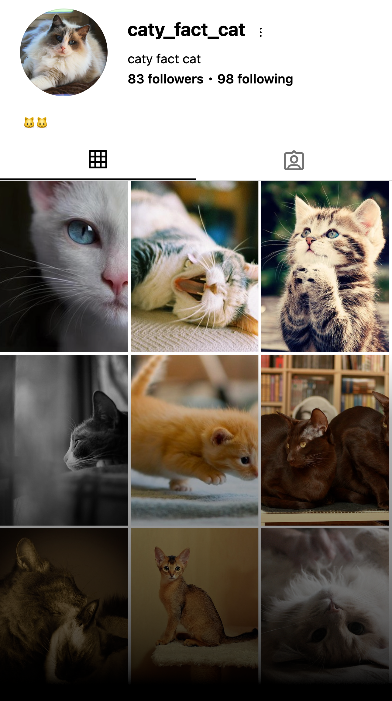

# 😺 Caty Fact Cat

An Instagram bot posting daily images of cats 🐈 with facts about them in the post caption caption.

You can check out the [instagram account](https://www.instagram.com/caty_fact_cat/) associated with the bot. Don't hesitate to follow 😉



## 🚀 Development

### Prerequisites

To be able to run this script, you need:

* Python >= 3.11
* [uv project manager](https://docs.astral.sh/uv/getting-started/installation/)

### Installation

Clone the repository:

```shell
git clone git@github.com:Yan-ni/caty-fact-cat.git
cd caty-fact-cat
```

Run the script:

```shell
uv run src/main.py
```
